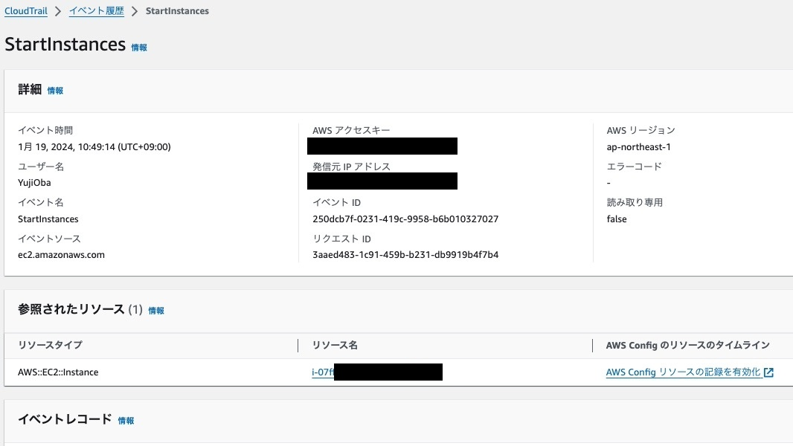
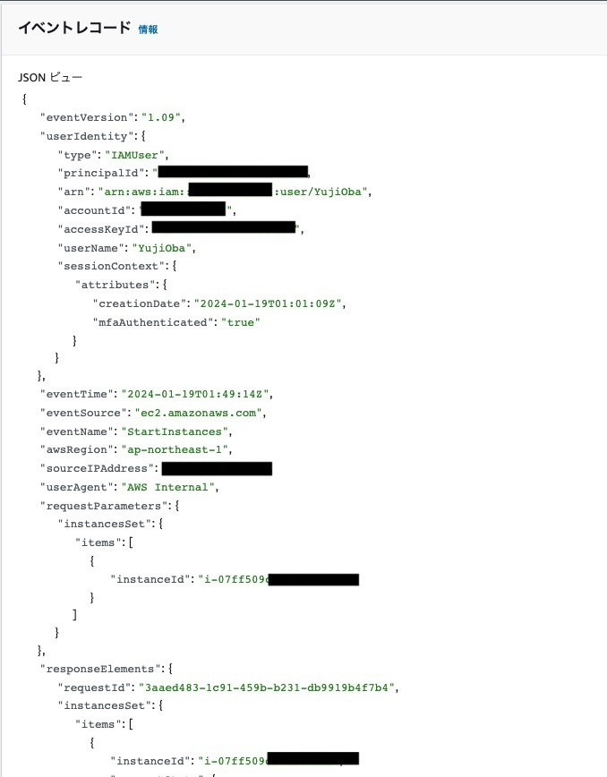
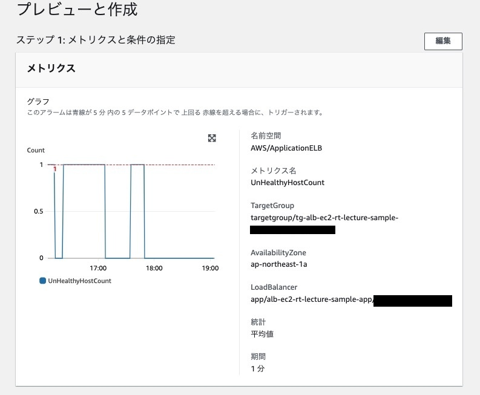
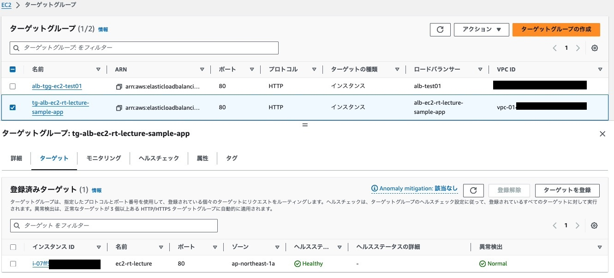
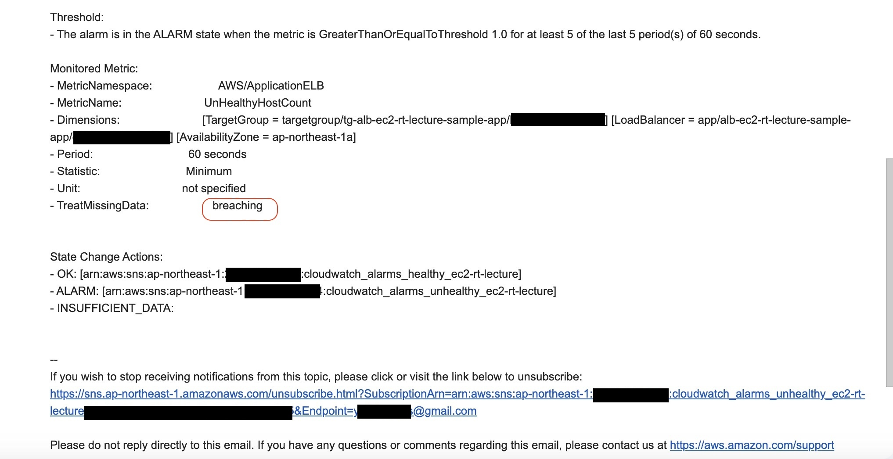
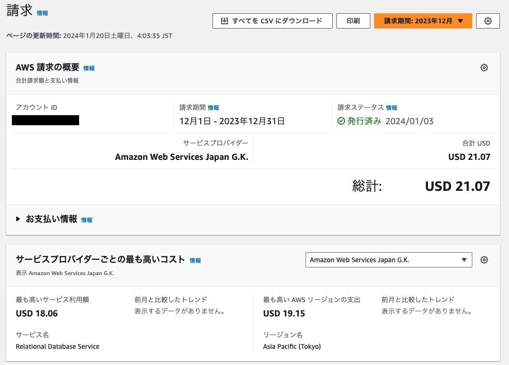

# lecture6

## CloudTrail

### 設定

- 証跡名 : `CloudTrail_WriteResouce_IAM_YujiOba`
- 管理イベントのみ
- 書き込みのみ
- AWS KMSイベントの除外
- RDSのデータAPIイベントを除外

### 証跡の取得

#### EC2インスタンスを起動

#### イベント履歴の確認

##### イベント選択

- StartInstances

##### イベントの情報を3つピックアップ

- `"userIdentity"` : イベントを起こしたユーザーの情報`type` `arn` `accountId` `userName`などがある
- `"eventTime": "2024-01-19T00:04:44z"` : イベントの発生日時（UTC）
- `"eventName": "StartInstances"` : 起きたイベントの名前

### CloudTrail イベント証跡から分かったこと

- 上記以外にも`arn` (aws resource name リソースを一意に識別)、`awsRegion`(イベントのあったリージョン)、`eventID` (各イベントID CloudTrailが生成)などなど、一つのイベントが発生すると、事細かにイベントの情報が定義されるのが分かる。
- マネジメントコンソール上での操作では気にしなかったが、プログラム上ではEC2を起動するために多くの情報が必要とされることが分かった。

## CloudWatch アラーム

### 設定

- 監視対象 : ELBとターゲットグループの`UnHealthyHostCount`
- 異常なEC2が1台でもあれば`アラーム`を実行する。
- 1分毎に収集したデータが5回連続で条件を満たした場合に`アラーム`を実行する。
- `UnHealthyHost`がある場合アラームとしてSNSに通知する。
- `UnHealthyHost`が無くなれば`HealthyHost`に移行したとして`OK`アクションとしてSNS通知する。
- `欠落データの処理`に欠落データを不正 (しきい値を超えている)として処理を選択。
  - EC2自体が停止している場合はデータ自体が取得できない。
  - EC2が停止した場合にアラームを実行するために、しきい値を超えた扱いにする。

### CloudWatch アラームの動作確認

#### OKアクション

##### ALBがUnhealthy→Healthyの状態へ

- サーバーを起動して`Healthy`の状態に

##### SNS通知

SNS通知の`Alarm Details`には名前や状態の遷移、時間、アカウントIDなどが記載
- `Alarm Details:`
  - `Name:CloudWatch_Alarm_HealthCheck`
  - `State Change:ALARM -> OK` ← `OK`状態に移行 
  - `Timestamp:Friday 19 January, 2024 10:47:22 UTC`
  - `AWS Account:***********`

また、`Monitored Metric:`に監視対象のメトリックも記載されている
- `Monitored Metric:`
  - `MetricNamespace:AWS/ApplicationELB`
  - `MetricName:UnHealthyHostCount`
  - `Dimensions:[TargetGroup = targetgroup/tg-alb-ec2-rt-lecture-sample-app/****************]`
    `[LoadBalancer = app/alb-ec2-rt-lecture-sample-app/****************]`
    `[AvailabilityZone = ap-northeast-1a]`

##### SNS 通知後のアプリサイトにアクセス

正常にサイトが起動していることが確認できる。

#### アラーム状態のアクション

##### Unicornを停止してUnHealthyの状態にする。

- サーバーの停止で`Unhealthy`の状態に

##### SNS通知

`Alarm Details:`
- `Name:CloudWatch_Alarm_HealthCheck`
- `State Change:OK -> ALARM` ← `アラーム`状態に移行
- `Timestamp:Friday 19 January, 2024 10:59:22 UTC`
- `AWS Account:***********`

##### SNS 通知後のアプリサイトにアクセス

- アクセスできないことが確認できる。

##### しきい値のグラフ

- `UnHealthyHostCount`が1の時に`アラーム`状態になる
- `UnHealthyHostCount`が0の時に`OK`になる。

#### 欠落データの処理の確認

##### EC2インスタンスを停止する

- ヘルスステータスは`Unused`

##### SNS通知

`Alarm Details:`
- `State Change:OK -> ALARM` ← `OK`から`アラーム`状態に移行
- `Timestamp:Friday 19 January, 2024 10:59:22 UTC`
- `Reason for State Change:  Threshold Crossed: no datapoints were received for 5 periods and 5 missing datapoints were treated as [Breaching].`

##### 注目点

- `State Change`が`OK`から`ALARM`に移行したことと`Reason for State Change`に`Breaching`として扱うと記載した部分に着目
- `欠落データの処理`に`欠落データを不正 (しきい値を超えている)として処理`の設定をしている=`Breahching`

- `TreatMissingData:breaching`
  - `breaching` : 欠落データは「不良」とされるので、`ALARM`状態としてSNS通知がされる

##### しきい値のグラフ 欠落データ処理

- アラーム状態であるが、`UnHealthyHost`をcountしてはいない。
- グラフも設定通り、データ欠落は`ALARM`と認識している。
- データ欠落状態でも`ALARM`になる設定、SNS通知される設定が作動している。

### CloudWatch学んだこと

- 監視、アラームの基本的な動作を学び、適切な設定により、サーバーダウン時のアラートなどの不具合時にも通知ができることが分かった。
- メトリクスの設定でEC2のCPUの使用率などのアラートなど、様々な監視とアラームが設定できる。
- CloudWatchを適切に使用することで、安全かつ高パフォーマンスの運用ができるのだろうと考えた。

## AWS コスト管理

### My Estimate

#### Pricing Calculator

[今日までに作成したリソースの見積 YujiOba 修正版](https://calculator.aws/#/estimate?id=1db1927ec9786cd94af4d3196fa350e2882d1370)

#### 見積設定

- 課題で使った格リソースを1つづつ構築したと想定して見積。
  - VPC
  - EC2
  - RDS
  - S3
  - ALB

**注釈**
- 私自身は課題＋復習用の新しいAWSリソースを構築している。
- 従って、自分が実際に作成したリソースの見積は約2倍になると認識する。

### AWS利用料の確認

#### Billing and Cost Management

##### 2023年12月請求

- 請求金額 : 21.07USD

##### 内訳

##### RDSで18.06USD利用料発生

- RDSのfree tier枠の750時間（青枠）から大幅に超えた分の約595時間（緑枠）に15.47USDの利用料発生。
  - 課題とは別に復習用のAWS環境を追加して1つ作成し、同様の環境が2つある状態のため。
  - 学習などでAWS環境利用後にRDSを停止せずに放置していた。

- Multi-AZ化の利用料（オレンジ枠）
  - DBインスタンスをpublicサブネットからprivateサブネットへ移動する手段としてMulti-AZ化して移動した。一時的な利用であるが料金発生。

- 汎用SSDのfree tier枠の20GB（水色）を超過分の約18GB（黄緑）に2.48USDの利用料発生
  - 課題とは別に復習用のAWS環境を追加して1つ作成し、同様の環境が2つある状態。
  - 学習などでAWS環境利用後にRDSを停止せずに放置していた。

##### EC2で1.09USD利用料発生

- EBSのfree tier枠の30GB（青枠）を超過分の1.09USD利用料発生
  - 課題とは別に復習用のAWS環境を追加して1つ作成し、同様の環境が2つある状態。
  - 学習用するにあたり、EC2インスタンスを何度か作成した。（test用で作成したり、設定を間違って再度作成したり。すぐに削除しないケースもあった。）
  - LinuxでEC2を作成した場合、デフォルトで8GBのSSDが割り当てられる。作成して削除するまでの間の利用料が発生している。

### AWS コスト管理から学んだこと

#### 見積

- 見積を作成する際にも、細かな仕様の設定が必要。自分自身がどのようなスペックでEC2、RDSなどを構築しているのか、しっかりと把握しなくてはいけない。
- また、どの程度使用するかなどある程度予測を立てた見積もできる。どの程度の容量が必要で、どの程度のアクセスがあるか、DBとのやりとりでどの程度アクセスがあるかなどの知識も必要になってくる。

#### 利用料の確認

- 特にRDSを停止することを気にしていなかった為に12月の使用料は多かった。学習するにあたってある程度想定しているが、減らせるのであれば減らして、コストへの意識を高めたい。
- 作成してすぐに削除した分や、DBを一時的にMulti-AZ化した分も利用料が発生していることが理解できた。
- 無料利用枠やそれぞれのサービス、リソースのコストの把握、知識も必要になってくることが理解できた。