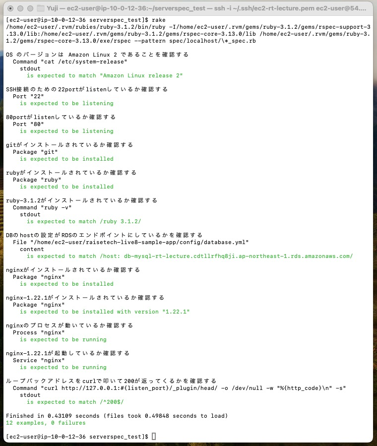

# lecture11 追加課題

## 目標

- **Serverspecのテストが成功すること**
  - 提供されたサンプルをカスタマイズOK
  - テスト定義に決まった答えはないので、自由な発想で色々試す


## Serverspec実施の概要

- サーバーが正しく構成されているかを確認するための RSpec テストを実施する。
- localでのテストを実施する。
- 第五回の課題で構築した環境をテストする。
- テストは`EC2`,`nginx`,`unicorn`,`RDS`,`ALB`が正常に動いている状態で実施した。


## Serverspec実施

### ディレクトリ構成

- `raisetech-live8-sample-app`ディレクトリとは別に`Serverspec`ディレクトリを作成し、作業用ディレクトリとした。

```zsh
ec2-user/
	├ raisetech-live8-sample-app
	├ serverspec_test/
```


- 作成した`serverspec_test`ディレクトリで`serverspec-init`コマンドから下記の環境でテストをした。

```zsh
Select OS type:
  1) UN*X

Select a backend type:
  2) Exec (local)
```


### テスト項目

- テスト項目は`sample_spec.rb`ファイルに記述する

```zsh
ec2-user/
	├ serverspec_test/
		├ spec/
			├ localhost/
				├ sample_spec.rb
```


- `sample_spec.rb`

```ruby
require 'spec_helper'

# --- OSのの確認 --- #
describe "OS のバージョンは Amazon Linux 2 であることを確認する" do
  describe command("cat /etc/system-release") do
    its(:stdout) { should match "Amazon Linux release 2" }
  end
end

# --- portの確認 --- #
describe "SSH接続のための22portがlistenしているか確認する" do #OK
  describe port("22") do
    it { should be_listening } 
  end
end

describe "80portがlistenしているか確認する" do #OK
  describe port("80") do
    it { should be_listening }
  end
end

# --- 各種インストールされているか確認する --- #
describe "gitがインストールされているか確認する" do
  describe package('git') do
    it { should be_installed }
  end
end

describe "rubyがインストールされているか確認する" do
  describe package('ruby') do
    it { should be_installed } 
  end
end

describe "ruby-3.1.2がインストールされているか確認する" do
  describe command('ruby -v') do
    its(:stdout) { should match /ruby 3.1.2/ }
  end
end

# --- DBのtest --- #
describe "DBのhostの設定がRDSのエンドポイントにしているかを確認する" do
  hostname = host_inventory['host']
  describe file('/home/ec2-user/raisetech-live8-sample-app/config/database.yml') do
    its(:content) { should match /host: #{'db-mysql-rt-lecture.cdtllrfhq8ji.ap-northeast-1.rds.amazonaws.com'}/ }
  end
end

# --- Nginxのtest --- #
describe "nginxがインストールされているか確認する" do
  describe package('nginx') do
    it { should be_installed }
  end
end

describe "nginx-1.22.1がインストールされているか確認する" do
  describe package('nginx') do
    it { should be_installed.with_version('1.22.1') }
  end
end

describe "nginxのプロセスが動いているか確認する" do
  describe process('nginx') do
    it {should be_running }
  end
end

describe "nginxが起動しているか確認する" do
  describe service('nginx') do
    it { should be_running }
  end
end

describe "ループバックアドレスをcurlで叩いて200が返ってくるかを確認する" do
  describe command('curl http://127.0.0.1:#{listen_port}/_plugin/head/ -o /dev/null -w "%{http_code}\n" -s') do
    its(:stdout) { should match /^200$/ }
  end
end
```


### テスト結果

- `sample_spec.rb`に記述したテスト内容が全て通る結果となった。


