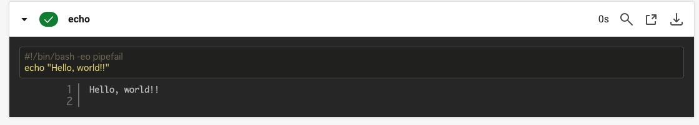

# Lecture12  追加課題


## CircleCiのサンプルコンフィグをリポジトリに組み込み正しく動作させる。


## 目次

- CircleCIを利用した自動テスト結果
  - CicrcleCI実行環境の準備
  - CircleCI自動テスト実行とエラー内容
  - エラー解消と自動テスト成功

以下、課題に対しての導入部分として記載

- CircleCI導入
  - CircleCi登録~GitHub連携
  - test用リポジトリでテスト

## CircleCIを利用した自動テスト結果


### CicrcleCI実行環境の準備
---


#### ディレクトリ構成とファイル

- CloudFormationのテンプレートファイルを`lecture12`ディレクトリに配置。
- `.circleci`ディレクトリを用意。
- `.circleci`ディレクトリに`config.yml`を用意。
- ディレクトリの構成を下記のようにする。

```zsh
RaiseTech
  ├── .circleci
  │     └── config.yml
  └── cloudformation
        ├── lecture10
        └── lecture12
              ├── cf-alb_lecture.yml
              ├── cf-ec2_lecture.yml
              ├── cf_iamrole_lecture.yml
              ├── cf_rds_lecture.yml
              ├── cf_s3_lecture.yml
              ├── cf_securitygroup_lecture.yml
              └── cf_vpc_lecture.yml
```


#### CircleCIサンプルコンフィグファイル

- `config.yml`ファイル内に提供されたサンプルコンフィグを記述。
- `command`が適切な階層でされるように修正。

```yaml
version: 2.1
orbs:
  python: circleci/python@2.0.3
jobs:
  cfn-lint:
    executor: python/default
    steps:
      - checkout
      - run: pip install cfn-lint
      - run:
          name: run cfn-lint
          command: |
            cfn-lint -i W3002 -t cloudformation/lecture12/*.yml #適切な階層を指定

workflows:
  raisetech:
    jobs:
      - cfn-lint
```


#### CIrcleCIプロジェクトを作成

- CircleCIのプロジェクトを作成する。
- プロジェクト名：`Lecture12_CircleCI_CF_Linter`
- リポジトリ：`RaiseTech`


### CircleCI自動テスト実行とエラー内容
---


#### 自動テスト実行

- 作業用のlecture12ブランチからGitHubに`push`。
- `push`がトリガーとなり、CIrcleCIの`cfn-lint`ジョブが走る。


#### 実行結果


#### エラー検出

- LinterによってCloudFormationのテンプレートファイルエラーを検出


#### エラー内容

- VPC,RDSのAZ指定の記述

```yaml
AvailabilityZone: "ap-northeast-1a"
```

ハードコーディング不可


- RDSのmasterpassword記述

```yaml
MasterUserPassword: n*********1 # パスワード
```

パスワードをそのままハードコーディングしていた。
セキュリティ上非常に危なく、セキュリティ意識が低い。


- S3のAccessControlの記述

```yaml
AccessControl: Private
```

defaultでPrivateで作成される。
Private以外でデプロイできない為、記述不要


### エラー解消と自動テスト成功
---


#### テンプレートファイルの修正

- cf_vpc_lecture.yml
  - 組み込み関数を使用して、`ap-northeast-1a`配列の値から取得する記述に変更

```yaml
  CFPublicSubnet1a:
    Type: AWS::EC2::Subnet
    Properties:
      AvailabilityZone: !Select 
        - 0 #ap-northeast-1aを指定
        - Fn::GetAZs: !Ref AWS::Region
```

※修正箇所のみ抜粋


- cf_rds_lecture.yml
  - `SecretsManager`を利用して`username`と`masterpassword`を管理する記述を追加
  - AZを組み込み関数で取得する記述に変更
  - `MasterUserPassword`を`SecretsManager`から取得する記述に変更

```yaml
Resources:
# --- RDS username masterpasswordをSecretsManagerで管理する定義 --- #
# username:admin --- #
# password:16文字のランダムなパスワード --- #
  CFRDSSecret: # RDSのパスワードとなるランダム文字列を生成
    Type: "AWS::SecretsManager::Secret"
    Properties:
      Name: "CFRDSSecret"
      Description: "RDS password for my RDS instance"
      GenerateSecretString:
        SecretStringTemplate: '{"username": "admin"}' #シークレットに含める項目
        GenerateStringKey: "password" #シークレット項目に追加するキー
        PasswordLength: 16 #16文字のランダムなパスワード
        ExcludeCharacters: '"@/\' #password生成時に使えない文字を指定
```

※追加記述のみ抜粋


```yaml
Resources:
# ----- RDSの定義 ----- #
# DBの設定 ap-northeast-1aに配置 MySQL 
  CFRDS:
    Type: AWS::RDS::DBInstance
    Properties:
      AvailabilityZone: !Select
        - 0 #ap-northeast-1aを指定
        - Fn::GetAZs: !Ref AWS::Region
      MasterUsername: admin
      MasterUserPassword: !Sub '{{resolve:secretsmanager:${CFRDSSecret}:SecretString:password}}' # SecretsManagerのランダム文字列を参照

```

※修正箇所のみ抜粋


- cf_s3_lecture.yml
  - `AccessControl`の記述をコメントアウト

```yaml
# ----- S3の定義 ----- #
  CFS3:
    Type: AWS::S3::Bucket
    Properties:
      # AccessControl: Private ##defaultでPrivateで作成される。Private以外でデプロイできない。
```

※修正箇所のみ抜粋


#### 自動テスト成功

- 再び作業用のlecture12ブランチからGitHubに`push`。
- `Status`が`Success`の表示になり、自動テストが成功したことがわかる。
- CircleCiのサンプルコンフィグをリポジトリに組み込み正しく動作させた。


以下、課題に対しての導入部分として記載

## CircleCI導入


### CircleCi登録~GitHub連携
---


#### CircleCi登録

- メールアドレス：GitHub登録と同じアドレス
- パスワード：任意


#### GitHub連携

- レポジトリに`CircleCI_test`を追加してCircleCI動作のテストをする
- CircleCIのproject作成の手順に従って進める
- プロジェクト名は`test01`とする。（CircleCI動作確認のテスト用）


1. GitHubへの認証のためSSHキーを生成して使用。

- `/Users/Yuji/.ssh`ディレクトリに`project_key.pub`(public SSH key)と`project_key`(private SSH key)が生成。

```zsh
ssh-keygen -t ed25519 -f ~/.ssh/project_key -C email@example.com
```


2. `public SSH key`をGitHubの`deploy keys`として登録

- `pbcopy`コマンドで`project_key.pub`ファイルの中身をクリップボードにコピー。

```zsh
pbcopy < ~/.ssh/project_key.pub
```


- コピーした`project_key.pub`をGitHubの`Develop Keys/Add new`の`key`に追加
- Title：任意


3. `private SSH key`をCircleCIに登録

- `project_key`のファイルの中身をコピー

```zsh
pbcopy < ~/.ssh/project_key
```


- CircleCIのプロジェクト作成画面で`private SSH key`を登録
- Repositoryを選択 → `CircleCI_test`のレポジトリでテストする


#### 連携成功

- 連携が成功し、`Projects`に作成したプロジェクトが追加。


### test用リポジトリでテスト
---

- test用の`CircleCI_test`リポジトリをクローンする。
- CircleCIのプロジェクトは`test01`
- GitHubへの`push`をトリガーとして`echo`コマンドで`Hello world!!`を出力する。


#### test用CircleCI実行環境の準備

- ローカルPCに`CircleCI_test`リポジトリをクローン


- `CircleCI_test`ディレクトリの構成を下記のようにする

```zsh
.circleci
 └── config.yml
README.md
```


- `config.yml`は下記のように記述

```yml
version: 2.1 #設定ファイルの記述方法
jobs: #実行させたいjobを定義
  test: #自由に名前を定義できる
    docker: #jobを実行するマシンを定義
      - image: circleci/ruby:2.6.3-stretch-node #CircleCIのdockerのイメージを設定 Rubyイメージを使用
    steps:
      - checkout #コードをレポジトリからチェックアウト
      - run: #実行する内容
          name: echo #echoの名称をつける
          command: echo "Hello, world!!" #コマンド Hello world!!出力
workflows: #定義したjobの実行タイミング
  test_workflow: #自由に名前を定義できる
    jobs:
      - test
```


#### CircleCIジョブの実行

- `main`ブランチからGitHubに`push`しCIrcleCIの動作確認をする。
- GitHubに`push`することがトリガーとなり、CIrcleCIの`test`ジョブが実行。
- `Hello, world!!`が出力されていることを確認。
- CIrcleCIとGitHubの連携、CIrcleCIのプロジェクトの実行を正常に行えていることを確認できた。




`Sign up enviroment`:環境設定
`Preparing enviroment variables`:環境変数の設定
`Checkout code`:stepsで記述したcheckout
`echo`:runで実行させたコマンドの名前

